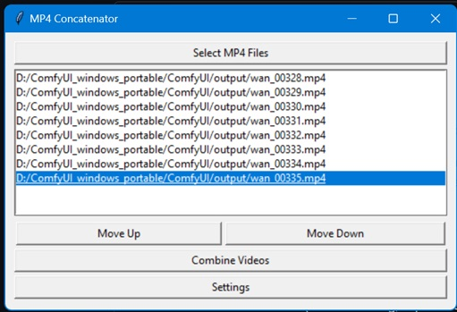

# video-combiner-gui
Select videos to combine into one longer video (MP4 Concatenator)

A simple Python + Tkinter GUI tool to **quickly combine multiple MP4 video files into one longer video**.  
Uses [FFmpeg](https://ffmpeg.org/) under the hood for fast, lossless concatenation (when possible), with a configurable re-encode option if clips don’t match.


---

## Features

- **Lossless Concatenation** (no re-encoding, super fast) if all clips share the same codec, resolution, framerate, and audio format.
- **Automatic Mismatch Detection**  
  - Warns you if clips differ.  
  - Lets you choose to re-encode them to a consistent format (H.264 + AAC by default).  
- **Re-encode Settings Dialog**  
  - Choose video codec (`libx264`, `libx265`, `vp9`)  
  - Choose audio codec (`aac`, `mp3`, or `copy`)  
  - Adjust CRF (quality level)  
  - Select encoding preset (`ultrafast` → `veryslow`)  
  - Pick resolution (keep original or scale to 1080p/720p/480p)  
- **File Ordering Controls**  
  - Files default to **alphabetical order** when selected.  
  - Move clips **Up/Down** to adjust order before concatenation.  
- **Simple GUI** — no command-line knowledge required.

---

## Requirements

- **Python 3.8+**
- **FFmpeg** installed and available in your system PATH  
  - Verify installation with:  
    ```bash
    ffmpeg -version
    ffprobe -version
    ```

Python dependencies (all standard library):
- `tkinter`
- `subprocess`
- `json`
- `os`

No external pip packages are required.

---

## Installation

Clone the repository:

```bash
git clone https://github.com/yourusername/mp4-concatenator.git
cd mp4-concatenator

Make sure FFmpeg is installed and available in your PATH. On different platforms:

Windows: Download from FFmpeg builds
, extract, and add bin/ folder to PATH.
```
## macOS:
```
brew install ffmpeg
```

## Linux (Debian/Ubuntu):
```
sudo apt update && sudo apt install ffmpeg
```

## Usage

Run the script with Python:

```
python mp4_concatenator.py
```

Steps:

1. Select MP4 Files → Pick the clips you want to merge (they will appear sorted alphabetically).

 (Optional) Adjust Order → Use Move Up / Move Down to reorder.

1. Click Combine Videos →

- If all clips match → concatenation is lossless and instant.

- If mismatch → a warning will ask if you want to re-encode.

1. Save As → Choose the output filename.

## Settings

Click the Settings button to configure re-encode options:

- Video codec

- Audio codec

- CRF quality

- Preset speed/efficiency

- Resolution (keep original or force scale)

## Example

Merging three clips named clip01.mp4, clip02.mp4, clip03.mp4:

1. Select all three files.

1. Order defaults to alphabetical (clip01 → clip02 → clip03).

1. Click Combine Videos.

1. Save output as final.mp4.

If the clips match, the merge takes only a few seconds and no quality is lost.

---

## Notes

Lossless concat requires identical codec, resolution, framerate, and audio.

If clips differ, re-encoding ensures compatibility but takes longer.

Temporary files (temp_*.mp4 and input.txt) are created during re-encode and automatically cleaned up.

---
## License

MIT License — feel free to use, modify, and share.
